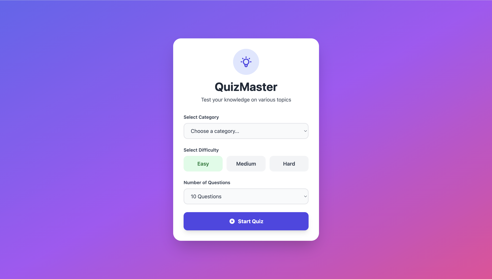
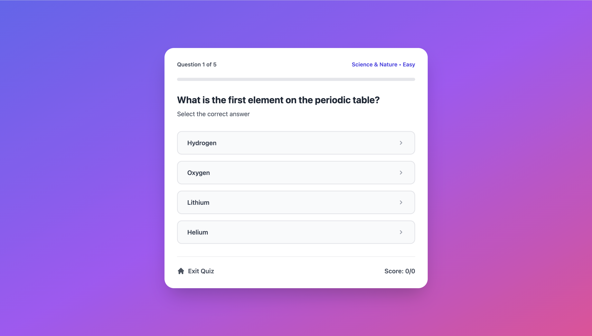
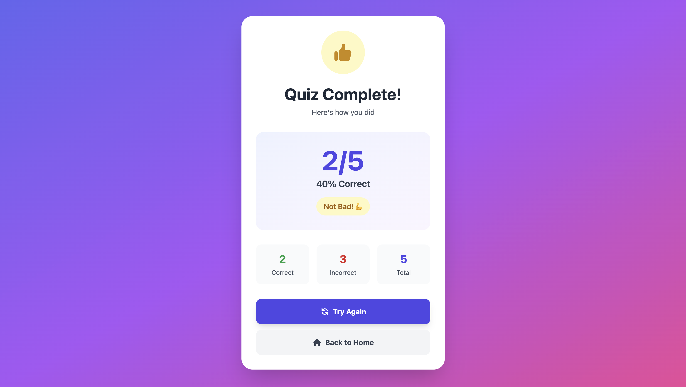

# 🎯 QuizMaster - Interactive Quiz Application

A fully responsive, single-page web application that allows users to test their knowledge across various topics using questions from the Open Trivia Database API.

**Live Demo:** https://rayo-johnson.github.io/quiz-app/
**Repository:** https://github.com/Rayo-Johnson/quiz-app

---

## 📸 Screenshots

### Landing Page

*Quiz configuration screen with category, difficulty, and question count selection*

### Quiz Screen

*Interactive quiz interface with progress tracking and instant feedback*

### Results Screen

*Final score display with detailed statistics and retry options*

---

## ✨ Features

### Core Functionality
- ✅ **Multiple Quiz Categories** - Choose from 8 different topics including Science, History, Sports, and Entertainment
- ✅ **Three Difficulty Levels** - Easy, Medium, and Hard options to match your skill level
- ✅ **Customizable Quiz Length** - Select 5, 10, or 15 questions per quiz
- ✅ **Real-time Score Tracking** - See your score update as you progress through the quiz
- ✅ **Instant Answer Feedback** - Visual feedback showing correct and incorrect answers
- ✅ **Progress Indicator** - Dynamic progress bar showing quiz completion status
- ✅ **Fully Responsive Design** - Seamless experience across desktop, tablet, and mobile devices

### User Experience
- 🎨 Modern, clean UI with gradient backgrounds and smooth transitions
- 🔄 Smooth screen transitions and loading states
- ⚡ Fast API integration with the Open Trivia Database
- 🎯 Clear visual feedback for all user interactions
- 📊 Detailed results with percentage, correct/incorrect breakdown
- 🔁 Easy retry and navigation options

---

## 🛠️ Technologies Used

- **HTML5** - Semantic markup and structure
- **CSS3 / Tailwind CSS** - Modern styling via CDN
- **JavaScript (ES6+)** - Vanilla JavaScript for all functionality
- **Open Trivia Database API** - Quiz questions and categories
- **Git & GitHub** - Version control and code hosting

---

## 🚀 Getting Started

### Prerequisites
- A modern web browser (Chrome, Firefox, Safari, Edge)
- Internet connection (for Tailwind CSS CDN and API calls)

### Installation

1. **Clone the repository**
   ```bash
   git clone https://github.com/Rayo-Johnson/quiz-app.git
   ```

2. **Navigate to the project directory**
   ```bash
   cd quiz-app
   ```

3. **Open in browser**
   
   **Option A:** Simply double-click `index.html`
   
   **Option B:** Use a local server (recommended)
   ```bash
   # Using Python
   python -m http.server 8000
   
   # Using Node.js
   npx http-server
   ```

4. **Visit the application**
   ```
   http://localhost:8000
   ```

---

## 📁 Project Structure

```
quiz-app/
├── index.html              # Main HTML file with all three screens
├── app.js                  # Complete JavaScript logic
├── assets/
│   └── designs/           # Design mockups and screenshots
├── README.md              # Project documentation
└── .gitignore             # Git ignore file
```

---

## 🎮 How to Use

### Starting a Quiz

1. **Select a Category** - Choose from 8 different quiz topics
2. **Choose Difficulty** - Click Easy, Medium, or Hard
3. **Pick Question Count** - Select 5, 10, or 15 questions
4. **Click "Start Quiz"** - The app will fetch questions from the API

### Taking the Quiz

- Read each question carefully
- Click your answer choice
- See instant feedback (green = correct, red = incorrect)
- Automatically move to the next question after 1.5 seconds
- Track your progress with the score counter and progress bar

### Viewing Results

- See your final score and percentage
- View correct vs incorrect breakdown
- Get a performance message based on your score
- Click "Try Again" to retake with same settings
- Click "Back to Home" to configure a new quiz

---

## 🔌 API Reference

This project uses the [Open Trivia Database API](https://opentdb.com/)

### Endpoint Used
```
GET https://opentdb.com/api.php
```

### Parameters
- `amount` - Number of questions (5-50)
- `category` - Quiz category ID
- `difficulty` - easy, medium, or hard
- `type` - multiple (multiple choice questions)

### Example Request
```
https://opentdb.com/api.php?amount=10&category=17&difficulty=easy&type=multiple
```

---

## 🎨 Design

### Color Palette
- **Primary:** Indigo (#6366f1)
- **Secondary:** Purple (#a855f7)
- **Accent:** Pink (#ec4899)
- **Success:** Green (#15803d)
- **Error:** Red (#dc2626)

### Typography
- **Font:** System fonts (Segoe UI, Tahoma, Geneva, Verdana, sans-serif)
- **Headers:** Bold, large sizes for impact
- **Body:** Regular weight for readability

---

## ✅ Features Implemented

- [x] Landing page with quiz configuration
- [x] Category selection (8 categories)
- [x] Difficulty selection (3 levels)
- [x] Question count selection
- [x] API integration with Open Trivia Database
- [x] Quiz screen with question display
- [x] Multiple choice answer selection
- [x] Answer validation and feedback
- [x] Progress tracking
- [x] Score calculation
- [x] Results screen with statistics
- [x] Retry functionality
- [x] Navigation between screens
- [x] Responsive design (mobile-friendly)
- [x] Loading states
- [x] Error handling
- [x] HTML entity decoding
- [x] Answer shuffling

---

## 🔜 Future Enhancements

Potential features for future versions:

- [ ] Quiz history saved in localStorage
- [ ] Performance tracking over time
- [ ] User accounts and profiles
- [ ] Leaderboard functionality
- [ ] Social sharing of scores
- [ ] More question types (True/False, Fill in the blank)
- [ ] Timed quiz mode
- [ ] Review mode with answer explanations
- [ ] Dark mode toggle
- [ ] Accessibility improvements (ARIA labels, keyboard navigation)

---

## 🐛 Known Issues

- None currently! If you find any bugs, please [open an issue](https://github.com/Rayo-Johnson/quiz-app/issues).

---

## 📝 Development Notes

### Challenges Overcome

1. **API Integration** - Successfully integrated with Open Trivia DB, handling JSON responses and error cases
2. **HTML Entity Decoding** - Implemented proper decoding for special characters in questions
3. **Answer Shuffling** - Used Fisher-Yates algorithm to randomize answer order
4. **State Management** - Built custom state management without frameworks
5. **Responsive Design** - Ensured great UX across all device sizes

### Learning Outcomes

- Real-world API integration experience
- Async/await and Promise handling
- DOM manipulation best practices
- Responsive design principles with Tailwind CSS
- Git workflow and version control
- Project planning and execution

---

## 📄 License

This project is open source and available under the [MIT License](LICENSE).

---

## 👤 Author

**Rayo Johnson**
- GitHub: [@Rayo-Johnson](https://github.com/Rayo-Johnson)
- Project: [QuizMaster](https://github.com/Rayo-Johnson/quiz-app)

---

## 🙏 Acknowledgments

- [Open Trivia Database](https://opentdb.com/) - For providing the free quiz API
- [Tailwind CSS](https://tailwindcss.com/) - For the utility-first CSS framework
- [Heroicons](https://heroicons.com/) - For the beautiful SVG icons
- My instructors and mentors for guidance and support

---

## 📬 Contact & Feedback

If you have any questions, suggestions, or feedback, please:
- Open an issue on GitHub
- Submit a pull request
- Contact me through GitHub

---

**⭐ If you found this project helpful, please consider giving it a star!**

---

*Built with ❤️ as a frontend development capstone project*

